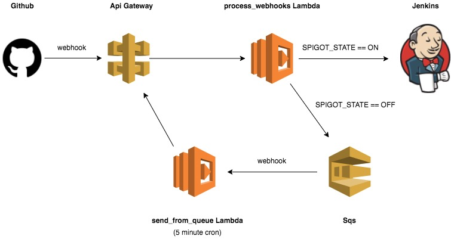

# 🚰 Spigot

A webhook queueing solution for Jenkins designed with AWS.

The spigot allows you to perform maintenance on Jenkins without losing any data. Previously, any webhooks sent to an instance that was being upgraded/ restarted would error out, failing to trigger the desired jobs and leaving code untested. However, with the Spigot in place, these webhooks are instead stored in a queue, and processed when Jenkins is back online.

# AWS

The following aws infrastructure is needed to utilize the code in this repository.

## Diagram




## AWS Setup

The following will need to be configured in the API Gateway:

* An API Stage Variable called **spigot_state** set to ON or OFF
* The Method Request will need:
    * A query_string parameter called **from_queue**
    * An HTTP Request header called **X-Github-Event**
* The Integration Request will need:
    * A body mapping template as follows:
    ```
    {
      "spigot_state": "$stageVariables.spigot_state",
      "from_queue": "$input.params('from_queue')",
      "body": $input.json('$'),
      "headers": {
        #foreach($header in $input.params().header.keySet())
        "$header": "$util.escapeJavaScript($input.params().header.get($header))" #if($foreach.hasNext),#end
        #end
      }
    }
    ```
* The Method Response will need:
    * A 200 HTTP Status
    * A 50 HTTP Status
* The Integration Response will need:
    * A default Lambda Error Regex mapping to a 200 Method response status
    * A Lambda Error Regex of **(\n|.)+** mapping to a 500 Method response status

The Lambdas will need:
* An environment variable called **LOG_LEVEL** with the desired cloud watch log level

Other setup:
* We have 2 s3 buckets that are also part of the spigot. One is used for deploying changes to lambda code, the other is for keeping credentials (such as the github token for posting on prs)
* The send_from_queue is triggered every 5 minutes with a cloudwatch event trigger

# Spigot State

When the spigot is **ON**, webhooks are sent to Jenkins. When the spigot is **OFF** they are instead stored in an SQS queue for later processing.

In order to toggle this state manually, simply run the toggle_spigot.py script with the desired flag. For example:
``` python
python toggle_spigot.py --toggle-state ON
```

In addition to this script, the spigot is also capable of turning itself off. This occurs when the Jenkins healthcheck inside the send_from_queue lambda function fails.
