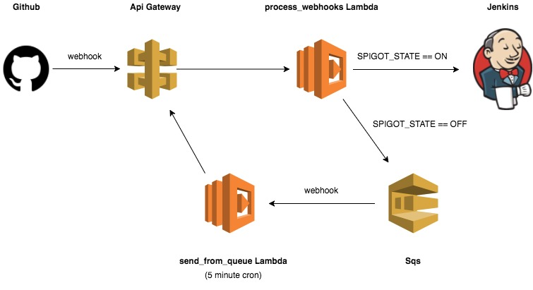

🚰 Spigot
==========

A webhook queueing solution for Jenkins designed with AWS.

The spigot allows you to perform maintenance on Jenkins without losing any data. Previously, any webhooks sent to an instance that was being upgraded/ restarted would error out, failing to trigger the desired jobs and leaving code untested. However, with the Spigot in place, these webhooks are instead stored in a queue, and processed when Jenkins is back online.

Diagram
-------

Setup
~~~~~

The spigot requires the following AWS infrastructure:

S3
--

First, you must have two s3 buckets. Create the following:
* A bucket for storing the lamdba functions contained in this repo
* A bucket storing credentials and other sensitive data used by the spigot

Lambdas
-------

Create two lambda functions, each of which use the code that will be stored
in the s3 buckets created in the previous steps. You should create:
* A lambda function for lambdas/process_webhooks
* A lambda function for lambdas/send_from_queue

Make sure that the lambdas have an environment variable called **LOG_LEVEL** with
the desired Cloud Watch logging level.

API Gateway
-----------

Configure an API Gateway to direct webhooks to the Spigot. You will need to

* An API Stage Variable called **spigot_state** set to ON or OFF
* The Method Request will need:
    * A query_string parameter called **from_queue**
    * An HTTP Request header called **X-Github-Event**
* The Integration Request will need:
    * A body mapping template as follows:

.. code:: velocity

    {
      "spigot_state": "$stageVariables.spigot_state",
      "from_queue": "$input.params('from_queue')",
      "body": $input.json('$'),
      "headers": {
        #foreach($header in $input.params().header.keySet())
        "$header": "$util.escapeJavaScript($input.params().header.get($header))" #if($foreach.hasNext),#end
        #end
      }
    }

* The Method Response will need:
    * A 200 HTTP Status
    * A 500 HTTP Status
* The Integration Response will need:
    * A default Lambda Error Regex mapping to a 200 Method response status
    * A Lambda Error Regex of **(\n|.)+** mapping to a 500 Method response status

CLOUDWATCH
----------

Create an event trigger for the send_from_queue lambda function

SQS
---

Create 2 SQS queues. The diagram shows the main queue, which is where hooks will be stored during Jenkins outages. However, it is a good idea to create a deadletter queue as well. This way, if a hook becomes malformed or fails multiple times for any other reason, it will be placed in the deadletter queue, where you can analyze it for debugging purposes.

Developing
~~~~~~~~~~

Download requirements for testing and deploying:

.. code:: bash

    make requirements

Check for style/quality issues with the lamdba code:

.. code:: quality

Run unit tests and generate a coverage report:

.. code:: bash

    make test

Deployment
~~~~~~~~~~

Set the following environment variables:

.. code:: bash

    export TARGET_URL=<URL of your target Jenkins instance>
    export SPIGOT_S3_BUCKET=<S3 bucket that contains your spigot code>

Download requirements for each lamdba, zip them up, and push them to your s3 bucket:

.. code:: bash

    make package
    make deploy

Controlling the Spigot
~~~~~~~~~~~~~~~~~~~~~~

Once the spigot is deployed, traffic is controlled by the API variable **spigot_state**. When
the spigot is **ON**, webhooks are sent to Jenkins. When it is **OFF**, they are stored in SQS
for later processing.

To manually turn the spigot on or off, 

.. code:: bash

    python utils/toggle_spigot.py --toggle-state <ON/OFF>

